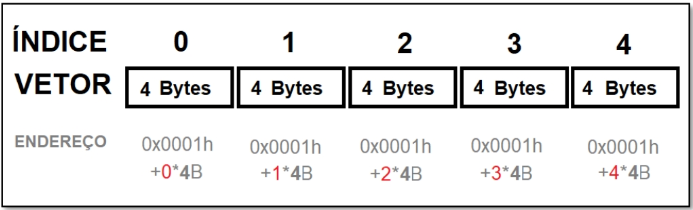

# Aula 01

Sumário

- [Aula 01](#aula-01)
  - [Tipos de Dados Primitivos](#tipos-de-dados-primitivos)
  - [Estruturas de dados homogêneas](#estruturas-de-dados-homogêneas)
    - [Array/Vetor](#arrayvetor)
  - [Estruturas de dados heterogêneas](#estruturas-de-dados-heterogêneas)

## Tipos de Dados Primitivos

Toda linguagem de programação possui os chamados tipos de dados `primitivos`, os quais consistem em tipos de dados básicos suportados nativamente por uma linguagem de programação em uma dada plataforma. Cada tipo de dado `primitivo` ocupa um espaço específico na memória. Vejamos os [dados primitivos](data_types.c) nativos da linguagem `C`.

Com os tipos de dados `primitivos` conseguimos expressar apenas valores únicos. Por exemplo:

```c
float nota1, nota2, media;
```

Para cada variável declarada (`nota1`, `nota2` e `media`) eu consigo registar somente 1 valor. Mas, e se eu quiser registrar as notas de uma avaliação da turma? A solução é sair dos tipos de dados `primitivos` e partir para tipos de dados mais `complexos`, cujas partes são de alguma forma organizados, ou seja, `estruturados`.

## Estruturas de dados homogêneas

Quando usamos uma `estrutura de dados` cujas partes são do mesmo tipo `primitivo`, nós temos uma `estrutura de dados homogênea`. A mais simples dessas estruturas de chama `array`, ou `vetor`. Conceitualmente um `vetor` é sempre uma `estrutura de dados` **unidimensional**, ou seja, possui apenas uma dimensão (imagine um plano cartesiano contendo valores apenas no eixo x). A partir do momento em que temos duas dimensões (novamente imagine um plano cartesiano, só que agora com os eixos x e y), a `estrutura de dados` passa a ser chamada de `matriz`. Por conseguinte, quando temos três ou mais dimensões (outra vez, imagine um plano cartesiano, mas agora com três eixos: x, y e z), passamos a ter um `tensor`.

### Array/Vetor

Um `array`/`vetor` é um tipo de estrutura de dados linear que necessita de somente **um índice** para indexação dos endereços dos elementos. Ele contém um número **fixo** de células, e cada célula armazenará um único valor, e todos os valores são do mesmo tipo. Ex.:

```c
float notas[30];
```

Quando declaramos um `vetor`, na memória do programa ele é inicializado (`alocado`) a partir da primeira posição, ou seja, a partir do `endereço de memória` da primeira célula. Cada célula seguinte possui um endereço de referência relativo à primeira célula. Vejamos [um exemplo](endereco.c).

Uma equação que generaliza a forma de cálculo de cada posição na memória de um `vetor` é a seguinte:

$$Endere\c{c}o_{n} = Endere\c{c}o_{0} + (Índice * Tamanho_{bytes})$$

<div style="text-align: center;">
    <br>
    <caption>Figura 01: Endereços das células a partir do endereço da primeira célula (fonte: livro-texto)</caption>
</div>

A partir da equação e figura acima, podemos entender porque no `C` o primeiro índice é 0.

## Estruturas de dados heterogêneas

A linguagem `C` permite a criação de uma estrutura de dados chamada `struct`. É, literalmente, uma forma de podermos criar e manipular `estruturas de dados heterogêneas`. A seguir um exemplo de uma estrutura que permite a junção de variados tipos de dados para descrever uma pessoa:

```c
struct Pessoa{
    char nome[50];
    int idade;
    float peso;
    float altura;
};
```

De forma similar às `estruturas de dados homogêneas`, quando declaramos uma variável de uma determinada `struct`, o programa reservará (ou alocará) um espaço na memória suficiente para armazenar todos os tipos de dados declarados. Por exemplo, uma variável da `struct` Pessoa, terá espaço alocado suficiente para 50 caracteres (literalmente 50 bytes), mais 4 bytes para a idade, outros quatro para armazenar o peso e outros quatro para armazenar o valor da altura, totalizando 50 + 12 = 62 bytes.