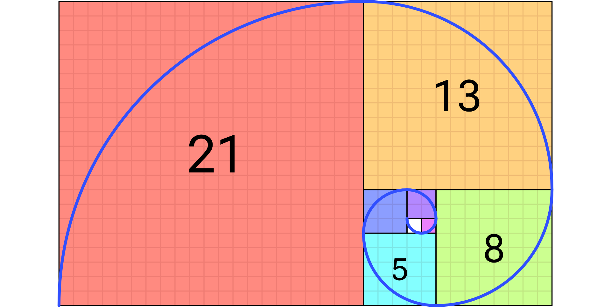

# Aula 03

Sumário

- [Aula 03](#aula-03)
  - [Adendo da aula anterior](#adendo-da-aula-anterior)
  - [Recursividade](#recursividade)
    - [Fatorial](#fatorial)
      - [Fibonacci](#fibonacci)
      - [Torre de Hanoi](#torre-de-hanoi)
  - [Alocação dinâmica e Ponteiros](#alocação-dinâmica-e-ponteiros)
    - [`Malloc`](#malloc)
    - [`Calloc`](#calloc)
    - [`Realloc`](#realloc)
    - [`Free`](#free)
    - [Ponteiros](#ponteiros)
  - [Desafios](#desafios)

## Adendo da aula anterior

Suponha o seguinte vetor $V = \{-5, -2, -1, 0, 1, 2, 4\}$. Para buscar um determinado valor neste vetor podemos utilizar um laço de repetição (e.g., `for`), verificando valor por valor até encontrar o número desejado. A complexidade desse algoritmo, com apenas um laço de repetição, é $O(n)$. É possível melhorar? Sim, com uma `busca binária`, por exemplo (assumindo que $V$ está ordenado).

Na `busca binária` a cada iteração, o espaço de busca é dividido ao meio. Portanto, a cada iteração teremos o seguinte:

| Problema original | $n$ | $n/2^{x}$ |
|---|---|---|
| Passo 1 | $n/2$ | $n/2^{1}$ |
| Passo 2 | $n/4$ | $n/2^{2}$ |
| Passo 3 | $n/8$ | $n/2^{3}$ |
| Passo 4 | $n/16$ | $n/2^{4}$ |

É possível perceber, a partir da terceira coluna, que a complexidade pode ser expressa pela seguinte expressão: $\dfrac{n}{2^{x}}$. Considerando que quando reduzimos um algoritmo à sua menor parte possível, sua complexidade será sempre unitária, ou seja, o custo único. Portanto, em algum momento, após $x$ passos, teremos o custo $1$. Portanto:

$$\dfrac{n}{2^{x}} = 1 \hspace{0.5cm} \therefore \hspace{0.5cm} n = 2^{x} \hspace{1cm} (1)$$

Essa última expressão lembra perfeitamente o conceito de `logaritmo`: $\hspace{0.15cm} log_{b}n = x \hspace{0.5cm} \therefore \hspace{0.5cm} n = b^{x} \hspace{1cm} (2)$.

Portanto, percemos que $(1) == (2)$! Logo **a complexidade da busca binária** é $O(log_{2}n)$

## Recursividade

Um algoritmo recursivo é aquele que utiliza a si próprio para atingir algum objetivo, ou obter algum resultado. Em programação, a recursividade está presente quando uma `função` (ou `método`) realiza chamadas a si mesma.

É muito empregado no conceito chamado `dividir para conquistar` para resolver um problema. Ele divide um problema maior em partes menores. Estas pequenas partes são solucionadas de forma mais rápida e eficiente. Todas as pequenas soluções são, portanto, agregadas para obter a solução maior e final para o problema.

### Fatorial

O `fatorial` é um exemplo clássico de recursividade. Temos duas formas de resolvê-lo: com um laço de repetição ou com recursividade. Vejamos as diferenças:

```c
int fatorial_iterativo(int n){
    int fat = 1;
    for(int i=1;i<=n;i++){
        fat *= i;
    }

    return fat;
}
```

```c
int fatorial_recursivo(int n){
    if(n == 1){
        return n;
    }else{
        return n*fatorial_recursivo(n-1);
    }
}
```

Note que ambos os algoritmos possuem complexidade $O(n)$, pois ambos serão executados $n$ vezes. Porém, na realidade o algoritmo recursivo tende a levar mais tempo de execução por causa da sobrecarga (ou `overhead`) para manter a pilha de chamadas de funções. Exemplo dessa pilha para o `fatorial_recursivo` com $n = 5$:

| Iteração | chamada |
|---|---|
| 1 | $fatorial\_recursivo(5)$ |
| 2 | $5 * fatorial\_recursivo(4)$ |
| 3 | $5 * 4 * fatorial\_recursivo(3)$ |
| 4 | $5 * 4 * 3 * fatorial\_recursivo(2)$ |
| 5 | $5 * 4 * 3 * 2 * fatorial\_recursivo(1)$ |
| 6 | $5 * 4 * 3 * 2 * 1$ |

Para $n \approxeq \infty$ o `overhead` se faz notar. Vejamos [um exemplo](fatorial.c).

Outros algoritmos que utilizam `recursividade`: 

#### Fibonacci

```c
// Sequência/Números de Fibonacci: 0, 1, 1, 2, 3, 5, 8, 13, 21, 34, 55, 89, 144, 233,...
int fibonacci(int n){
    if(n < 2){
        return n;
    }else{
        return fibonacci(n-1) + fibonacci(n-2);
    }
}
```

<div style="text-align: center;">
    <br>
    <caption>Figura 01: Visualização da Sequência de Fibonacci</caption>
</div>

#### Torre de Hanoi

```c
void hanoi(int n, char inicio, char fim, char aux){
    if(n > 0){
        // Movendo n - 1 discos do início para o auxiliar para não "atrapalharem"
        hanoi(n-1, inicio, aux, fim);

        // Movendo o n-ésimo disco do início para o fim
        printf("Mova o disco %d de %c para %c\n", n, inicio, fim);

        // Movendo os n-1 discos que deixamos no auxiliar para o fim
        hanoi(n-1, aux, fim, inicio);
    }
}
```

<div style="text-align: center;">
    <br>
    <caption>Figura 02: Torre de Hanoi</caption>
</div>

## Alocação dinâmica e Ponteiros

Recapitulando da [Aula 01](../aula01/aula01.md), quando precisamos manipular um grande conjunto de `variáveis` podemos utilizar de `estruturas de dados` adequadas. Vimos o `array` ou `vetor` como uma `estrutura de dados homogênea` e as `estruturas` (ou `structs`) como `estruturas de dados heterogêneas`.

Perceba que nessas situações só precisamos saber o "nome" da estrutura e, assim, temos acesso a todos os demais elementos. Esse tipo de estrutura é chamada de `estática`, porque a quantidade de elementos nela é **definida uma vez** e **não pode ser mudado depois**. Vejamos [um exemplo](ed_estatica.c).

`Estruturas de dados estáticas` são recomendadas quando você sabe de antemão a quantidade de elementos que irá manipular. No exemplo que vimos, manipulamos 10 elementos em todas as estruturas.

Contudo, podemos nos deparar com situações onde não saberemos com quantas "variáveis" iramos lidar. O que fazer? Neste caso podemos utilizar da `alocação dinâmica` de memória. A `alocação dinâmica` de memória significa que iremos pedir ao S.O. por espaços de memória à medida em que forem necessários. Portanto, se precisarmos de somente dois espaços, pedimos só dois. Mas se precisarmos de 10, pediremos os 10. Se for 1000, pediremos os 1000.

A partir da biblioteca `stdlib` temos acesso a quatro funções em `C` para o `gerenciamento dinâmico` de memória: `malloc`, `calloc`, `realloc` e `free`.

### `Malloc`

Vem de *memory allocation*. Sintaxe:

```c
void* malloc(size_t size);
```

Aloca um `bloco de memória` com `size` bytes e retorna um `ponteiro` para o primeiro byte do bloco. Se houver alguma falha na alocação, é retornado o valor `NULL`. O conteúdo do bloco alocado não é inicializado, ou seja, pode conter `lixo`.

No lugar de `void` podemos indicar outro tipo de dado com `cast`. Ex.: `(int*)malloc(size_t size)`.

O `size_t` indica que esse valor é do tipo `unsigned int`. Normalmente definimos esse valor utilizando a função `sizeof()`. Ex.:

```c
typedef struct{
    ...
}pessoa;

int main(){
    pessoa *p;

    // Reservando espaço suficiente para a estrutura
    p = (pessoa*)malloc(sizeof(pessoa));

    return 0;
}
```

Mais detalhes [aqui](https://cplusplus.com/reference/cstdlib/malloc/).

### `Calloc`

Vem de *contiguous allocation*. A sintaxe:

```c
void* calloc(size_t num, size_t size);
```

Aloca um `bloco de memória` para um `array` de `num` elementos, cada um com `size` bytes, e inicializa todos os bits como 0. Retorna um `ponteiro` para o primeiro byte do bloco. Se houver alguma falha na alocação, é retornado o valor `NULL`. O `cast` pode ser utilizado aqui também:

```c
(int*)calloc(10, sizeof(int));
```

Mais detalhes [aqui](https://cplusplus.com/reference/cstdlib/calloc/).

### `Realloc`

Vem de *reallocation*. Sintaxe:

```c
void* realloc(void* ptr, size_t size);
```

Muda o tamanho do bloco de memória apontado por `ptr` para `size`, podendo ser maior ou menor do que era antes. Se o tamanho for:

* Maior: o `realloc` pode precisar mudar o endereço. Neste caso o conteúdo anterior é copiado para o novo endereço. 
* Menor: o endereço continuará o mesmo.

Caso não haja espaço necessária para a realocação, o `realloc` retorna `NULL`. O `cast` pode ser utilizado aqui também:

```c
(int*)realloc(ptr, 5*sizeof(int))
```

Mais detalhes [aqui](https://cplusplus.com/reference/cstdlib/realloc/).

### `Free`

Função para liberar memória. Sintaxe:

```c
void free(void* ptr);
```

Um bloco de memória previamente alocado através de `malloc`, `calloc` ou `realloc` é desalocado, liberando este bloco de memória para outro uso.

Caso você esqueça de liberar este espaço, o `coletor de lixo` (`garbage collector`) do S.O. vai desalocar depois. Porém, **deixar de desalocar não é uma boa prática**.

### Ponteiros

Até então os `ponteiros` foram somente citados. O que eles são?

De forma bastante simplificada um `ponteiro` é uma `variável` **especial** que armazena um `endereço de memória`.

```c
int a; // Um valor do tipo inteiro pode ser armazenado em a
int *p; // Um endereço de memória para um valor do tipo inteiro pode ser armazenado em p

// Portanto, podemos ter
p = &a;
```

`Ponteiros` são bastante úteis principalmente quando lidamos com `alocação dinâmica` de memória. Portanto, não precisamos dar nome a variáveis, bastando guardar seus endereços de memória. Para melhorar ainda mais, podemos criar variadas estruturas de dados, e ter apenas alguns poucos ponteiros que serão suficientes para lidarmos com todos os dados. Ao longo do semestre veremos muitos exemplos.

## Desafios

Vamos tentar resolver os seguintes desafios:

* **DESAFIO 01**
  * Crie um programa que tenha uma estrutura chamada `pessoa` com os seguintes atributos:
    * Nome;
    * Idade;
    * Peso;
    * Altura;
    * CPF.
  * Dentro do `main` o programa deve ser capaz de fornecer ao usuário as seguintes opções:
    * Criar e preencher os dados da estrutura `pessoa`;
    * Imprimir os valores;
    * Editar os valores;
    * A criação e manipulação da estrutura deve ser feita com `ponteiro`.
  * Por enquanto não vamos mexer com `arrays`, então teremos somente 1 `pessoa`.
* **DESAFIO 02**
  * Altere o programa passado, acrescentando uma estrutura chamada `conta`, com os seguintes atributos:
    * Número da conta;
    * Código do banco;
    * Saldo;
    * Nome do titular;
    * CPF do titular.
  * Agora você deve ligar as duas estruturas da seguinte maneira:
    * Acrescente à estrutura `pessoa`, 1 variável do tipo `conta`;
    * O usuário do sistema agora deverá ter como acrescentar os dados da conta;
    * O nome e CPF do titular devem ser ponteiros para os campos existentes na estrutura `pessoa`.
* **DESAFIO 03**
  * Agora você deve acrescentar uma estrurutra chamada `curso`, com os seguintes atributos:
    * Nome;
    * Quantidade de períodos;
    * Quantidade de disciplinas;
    * Nome da faculdade;
    * Valor mensal;
  * Crie outra estrutura chama `disciplina`, com os seguintes atributos:
    * Nome;
    * Carga horária;
    * Turno.
  * Volte à estrutura `curso` e acrescente um `array` que caibam 3 disciplinas.
  * Volte à estrutura `pessoa`e acrescente a variável para o `curso`.
  * O usuário deve ser capaz de criar até 3 `pessoas` e preencher, ou não, os campos. Os campos não preenchidps devem ser inicializados de alguma forma (ex.: se for String, deve ser inicializado com NULL).
  * A estrutura `pessoa` deve receber um novo campo chamado `matrícula`, a qual só deve ser um valor se a `pessoa` estiver em ao menos 1 `disciplina`.
  * Por fim, vocês devem criar um `ponteiro` que possa manipular cada valor da `pessoa` caso o usuário decida pela edição.