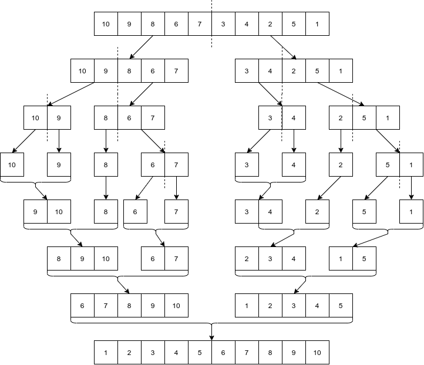

# Aula 04

Sumário

- [Aula 04](#aula-04)
  - [Ordenação](#ordenação)
    - [Bubble sort](#bubble-sort)
    - [Merge sort](#merge-sort)
    - [Quick sort](#quick-sort)
    - [Comparativo entre os três algoritmos vistos](#comparativo-entre-os-três-algoritmos-vistos)

## Ordenação

A tarefa de ordenação é muito comum, tanto que lidamos com ordenações sem nem percebermos. Exemplos:

* Ordenar os e-mails por data de recebimento (crescente/decrescente);
* Ordenar uma lista de filmes a partir das notas recebidas pelos usuários;
* [Lista de países de acordo com o PIB PPC](https://pt.wikipedia.org/wiki/Lista_de_pa%C3%ADses_por_PIB_(Paridade_do_Poder_de_Compra));
* Ordenar uma lista de pessoas em ordem alfabética.

> Um algoritmo de ordenação é um método que descreve como é possível colocar, em uma ordem específica, um conjunto de dados qualquer.

Tais algoritmos devem ser independentes dos tipos de dados que serão ordenados, do volume de dados e da linguagem de programação utilizada. A busca pelo melhor algoritmo é ainda um problema em aberto, pois não temos uma solução em definitivo. Porém, já temos algoritmos muito eficientes para problemas específicos.

### Bubble sort

O *Bubble sort* é um dos mais simples --- senão o mais simples. Porém, tem um alto custo computacional e é bastante ineficiente, consequência da utilização de dois laços. Como ele funciona: [Vídeo explicativo 1](https://www.youtube.com/watch?v=i2IKFmI_gyk), [Vídeo explicativo 2](https://www.youtube.com/watch?v=Iv3vgjM8Pv4), [Vídeo explicativo 3](https://www.youtube.com/watch?v=xli_FI7CuzA).

**Comportamento assintótico**: $O(n^{2})$.

### Merge sort

Neste algoritmo uma estrutura de dados é repartiva recursivamente até que restem somente partes indivisíveis. A ordenação ocorre entre essas partes, as quais são posteriormente juntadas para formar uma estrutura de dados ordenada. Exemplos: [Vídeo explicativo 1](https://www.youtube.com/watch?v=BnsYGiYYdnQ), [Vídeo explicativo 2](https://www.youtube.com/watch?v=dENca26N6V4), [Vídeo explicativo 3](https://www.youtube.com/watch?v=4VqmGXwpLqc).

     
    <caption>Figura 01: Merge sort com o nosso array de exemplo</caption>

**Comportamento assintótico**: $O(n.log(n))$.

### Quick sort

É eficiente e fácil de implementar. Este algoritmo trabalha com o conceito de um **pivô**, ou seja, um elemento escolhido como a referência de comparação para outros valores. Como ele funciona: [Vídeo explicativo 1](https://www.youtube.com/watch?v=WP7KDljG6IM), [Vídeo explicativo 2](https://www.youtube.com/watch?v=3San3uKKHgg), [Vídeo explicativo 3](https://www.youtube.com/watch?v=Hoixgm4-P4M).

**Comportamento assintótico**: $O(n^{2})$

### Comparativo entre os três algoritmos vistos

| Algoritmo | $\Omega$ | $\Theta$ | $O$ |
|---|---|---|---|
| Bubble sort | $\Omega(n)$ | $\Theta(n^{2})$ | $O(n^{2})$ |
| Merge sort | $\Omega(n.logn)$ | $\Theta(n.logn)$ | $O(n.logn)$ |
| Quick sort | $\Omega(n.logn)$ | $\Theta(n.logn)$ | $O(n^{2})$ |