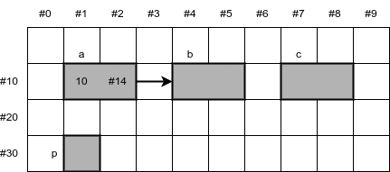
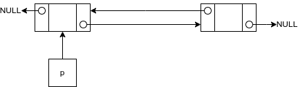

# Aula 06

**Sumário**

- [Aula 06](#aula-06)
  - [Listas](#listas)
  - [Listas simplesmente encadeadas](#listas-simplesmente-encadeadas)
    - [Definindo funções](#definindo-funções)
      - [Inserindo um novo elemento ao fim de uma lista](#inserindo-um-novo-elemento-ao-fim-de-uma-lista)
      - [Inserindo um novo elemento no início de uma lista](#inserindo-um-novo-elemento-no-início-de-uma-lista)
      - [Inserindo um novo elemento no meio de uma lista](#inserindo-um-novo-elemento-no-meio-de-uma-lista)
      - [Imprimindo a lista](#imprimindo-a-lista)
      - [Excluindo um elemento do fim da lista](#excluindo-um-elemento-do-fim-da-lista)
      - [Excluindo um elemento do início da lista](#excluindo-um-elemento-do-início-da-lista)
      - [Excluindo um elemento do meio da lista](#excluindo-um-elemento-do-meio-da-lista)
  - [Listas duplamente encadeadas](#listas-duplamente-encadeadas)
    - [Inserindo um novo elemento no fim da lista](#inserindo-um-novo-elemento-no-fim-da-lista)
    - [Inserindo um novo elemento no início da lista](#inserindo-um-novo-elemento-no-início-da-lista)
    - [Inserindo um novo elemento no meio da lista](#inserindo-um-novo-elemento-no-meio-da-lista)
    - [Excluindo um elemento do fim da lista](#excluindo-um-elemento-do-fim-da-lista-1)
    - [Excluindo um elemento do início da lista](#excluindo-um-elemento-do-início-da-lista-1)
    - [Excluindo um elemento no meio da lista](#excluindo-um-elemento-no-meio-da-lista)
  - [Exercício](#exercício)

Na [aula 03](../aula03/aula03.md) vimos sobre `alocação dinâmica` de memória. Pudemos ver que é possível dispormos de memória dinamicamente quando houver a necessidade, e liberar o espaço utilizado quando não precisamos mais. Isto é uma grande vantagem sobre a utilização de `estruturas de dados estáticas`, pois nelas a quantidade de memória alocada é fixa, ou seja, se precisarmos de mais teríamos de alocar um novo espaço maior e copiar todos os elementos. E se não estivermos usando todo o espaço, ele continuará ocupado, ainda que não utilizado.

Uma vez lembrados da `alocação dinâmica` de memória, vamos ver sobre uma das estruturas de dados mais fundamentais: `listas`.

## Listas

Uma `lista` é uma sequência de valores ordenados. Ou seja, em uma lista conseguimos armazenar diversos valores e podemos percorrê-la item a item, onde cada item possui um `índice`. Um `array` pode ser considerado uma `lista` de valores homogêneos, porém uma lista `estática`. Como, então, é uma `lista` alocada dinamicamente?

Para conseguirmos fazer com que um conjunto de elementos alocados dinamicamente sejam dispostos em sequência, precisamos utilizar os `ponteiros`. Os elementos da `lista` já não podem mais ser de um tipo de dado primitivo. Eles passam a ser um `tipo de dado abstrato` (TAD). Em `C`, representamos um elemento de uma `lista` através de um `struct`, o qual terá seus atributos, ou campos, como vimos anteriormente e, ao fim, um `ponteiro` que possa armazenar o endereço dessa `struct`.

A partir disso, sempre que quisermos adicionar algum elemento à lista, alocamos dinamicamente um bloco de memória para o novo elemento e passamos o seu endereço para o ponteiro do elemento que já existia. A seguir uma imagem ilustrando uma `lista` com três elementos.

<div style="text-align: center;">
    <br>
    <caption>Figura 01: Uma lista alocada dinamicamente, com três elementos.</caption>
</div>

Analisando cada elemento é possível perceber que temos um `ponteiro` **p** que aponta para o primeiro elemento da `lista`. Este primeiro elemento possui um `ponteiro` que armazena o endereço do segundo elemento. O segundo elemento tem um `ponteiro` com o endereço do terceiro elemento, cujo `ponteiro` não armazena qualquer endereço.

A `Figura 01` mostra um exemplo de uma `lista simplesmente encadeada`. Outro tipo de `lista encadeada`, ou **ligada** é a `lista duplamente encadeada`. Vejamos a seguir detalhes de cada uma.

## Listas simplesmente encadeadas

Como já vimos acima, uma `lista simplesmente encadeada` é uma estrutura de dados onde cada elemento possui um `ponteiro`, o qual guarda o endereço do elemento seguinte. Se não houver um elemento seguinte, o valor no `ponteiro` será `NULL`.

O elemento de uma `lista`, de forma bastante simplificada, pode ser definido da seguinte forma:

```c
// declaração forward da estrutura
typedef struct elemento
{
    int valor;
    struct elemento *proximo;
} elemento_t; // aqui o 'tipo' é definido ... o nome ficou como 'elemento_t' para ficar mais próximo do estilo da linguagem.
```

A partir disso, podemos começar a criar nossa `lista`, porém precisamos ficar atentos aos seguintes detalhes:

1. Todo elemento de uma `lista` é um bloco de memória alocado dinamicamente, portanto, seu endereço deve estar guardado em algum `ponteiro`.
   1. O endereço do primeiro elemento deve estar armazenado em um `ponteiro` específico para a lista.
2. No programa em que manipulamos uma `lista` devemos disponibilizar:
   1. Função para a criação de novos elementos.
      1. E junto a esta função o código para a inserção do elemento na lista.
   2. Função para a exclusão de algum elemento.
      1. E junto a esta função o código necessário para reorganizar a lista.
   3. Função para percorrer a lista.

A partir de agora vamos montar um programa, passo a passo, começando de forma bastante simples e melhorando com o tempo. Vamos iniciar criando três variáveis da nossa estrutura, e um ponteiro que possa armazenar seu endereço de memória.

```c
int main()
{
    elemento_t a, b, c, *p;
    ...
```

Após a execução desse código, nossa memória estará mais ou menos assim:

<div style="text-align: center;">
    <br>
    <caption>Figura 02: Representação simples da memória com três estruturas e um ponteiro.</caption>
</div>

Continuando

```c
    ...
    a.valor = 10;
    ...
```

<div style="text-align: center;">
    <br>
    <caption>Figura 02 (a): Adicionando um valor ao campo numérico <i>valor</i> da estrutura <b>a</b>.</caption>
</div>

```c
    ...
    a.proximo = &b;
    ...
```

<div style="text-align: center;">
    <br>
    <caption>Figura 02 (b): Adicionando o endereço da estrutura <b>b</b> ao campo <i>proximo</i> da estrutura <b>a</b>.</caption>
</div>

```c
    ...
    b.valor = 20;
    b.proximo = &c;

    c.valor = 30;
    c.proximo = NULL; // garantindo que vai ser NULL, para evitar um possível loop infinito
    ...
```

<div style="text-align: center;">
    <br>
    <caption>Figura 02 (c): Preenchendo os campos das estruturas <b>b</b> e <b>c</b>.</caption>
</div>

```c
    ...
    p = &a;
    ...
```

<div style="text-align: center;">
    <br>
    <caption>Figura 02 (d): Armazenando o endereço da estrutura <b>a</b> no ponteiro <b>p</b>.</caption>
</div>

Agora vamos percorrer essa `lista` através do `ponteiro` **p**, e mostrar na tela o valor armazenado em cada elemento.

```c
    while(p != NULL)
    {
        printf("%d ", p->valor);
        p = p->proximo;
    }

    printf("Fim");

    return 0;
}
```

Como **p** está apontando para a estrutura **a**, veremos na tela o seguinte valor:

> 10

Logo em seguida, o valor de **p** será atualizado para o endereço armazenado no `ponteiro` **proximo**.

<div style="text-align: center;">
    <br>
    <caption>Figura 02 (e): Atualização do valor do ponteiro <b>p</b>.</caption>
</div>

Voltamos ao `printf` e agora a mensagem da tela estará assim:

> 10 20

O valor de **p** é atualizado novamente:

<div style="text-align: center;">
    <br>
    <caption>Figura 02 (f): Atualização do valor do ponteiro <b>p</b>, agora apontando para a estrutura <b>c</b>.</caption>
</div>

A mensagem na tela é atualizada mais uma vez:

> 10 20 30

O valor de **p** é atualizado de novo, mas desta vez seu valor passará a ser `NULL`. 

<div style="text-align: center;">
    <br>
    <caption>Figura 02 (g): O valor do ponteiro <b>p</b> agora é NULL.</caption>
</div>

Por causa disso a condição do laço `while` se torna falsa e a execução continua na linha seguinte. A mensagem na tela é atualizada pela última vez, passando a consistir em:

> 10 20 30 Fim

O código completo visto acima está [neste arquivo](aula06_exemplo01.c).

### Definindo funções

Agora vamos atualizar o nosso programa para ter funções responsáveis por alocar dinamicamente cada novo elemento, e também funções para a inserção e remoção de elementos da `lista` (o código completo do algoritmo com as funções pode ser visto em duas versões: [a mais simples](lse.c), e [a um pouco mais complexa](lse2.c)).

Primeiramente podemos criar uma função responsável pela criação de todos os novos elementos a serem adicionados à lista:

```c
01  elemento_t* criarElemento(int valor){
02      // Criando novo elemento
03      elemento_t *novo = (elemento_t *)malloc(sizeof(elemento_t));
04      // Se a memória não tiver sido alocada
05      if (novo == NULL){
06          return NULL;
07      }
08      novo->valor = valor;
09      novo->proximo = NULL;
10   
11      return novo;
12  }
```

A função `criarElemento` retorna um `ponteiro` para o tipo `elemento_t` que criamos. A função ainda recebe um valor como parâmetro. Na linha `03` é onde alocamos dinamicamente memória, ou seja, é onde criamos, de fato, um novo elemento. Porém, pode acontecer de a alocação de memória falhar por algum motivo. Neste caso o ponteiro `novo` ficaria com o valor `NULL` em vez de um endereço de memória. Se isso acontecer, então retornamos o valor `NULL`. Note que o `return` também tem o papel de fazer a execução do programa sair da função, ignorando todo o resto do código. Mas uma vez que a alocação foi bem sucedida, assinalamos ao campo `valor` o valor fornecido e o valor `NULL` para o ponteiro do elemento.

Agora que temos como criar novos elementos, temos de criar uma função para inseri-los na lista. Há algumas formas diferentes de inserção:

* Inserir no fim.
* Inserir no início.
* Inserir no meio
  * A partir de um índice fornecido;
  * A partir de um valor fornecido.

#### Inserindo um novo elemento ao fim de uma lista

A ideia principal é como segue:

<div style="text-align: center;">
    <br>
    <caption>Figura 03 (a): Vamos inserir o elemento <b>d</b> ao fim da lista.</caption>
</div>

Supondo uma lista já criada, como da **Figura 03 (a)**, vamos tentar inserir em seu fim o novo elemento criado. Para isso precisamos percorrer a lista até alcançar o último elemento. Fazemos isso com o uso de um `ponteiro` auxiliar, como visto nas figuras a seguir.

<div style="text-align: center;">
    <br>
    <br>
    <br>
    <caption>Figura 03 (b): Percorrendo a lista com o ponteiro <i>aux</i>.</caption>
</div>

Para percorrermos uma lista podemos implementar o seguinte código:

```c
elemento_t *aux = lista; // ponteiro aux apontando para o primeiro elemento da lista

while (aux->proximo != NULL){
    aux = aux->proximo;
}
```

Assim que chegamos no elemento **c**, o seu ponteiro `proximo` está com o valor `NULL`, então a condição do `while` se torna falsa. Então, após o `while` fazemos com que o ponteiro `proximo` de **c** aponte para **d**.

<div style="text-align: center;">
    <br>
    <caption>Figura 03 (c): Elemento <b>c</b> apontando para <b>d</b>, que agora passa a ser o último da lista.</caption>
</div>

A seguir, o código da função para inserir no fim da lista:

```c
void inserirFim(elemento_t *lista, int valor){
    // Criando novo elemento para ser inserido ao fim da lista
    elemento_t *novo = criarElemento(valor);
    // Criando ponteiro para percorrer a lista
    elemento_t *aux = lista;

    while(aux->proximo != NULL){
        aux = aux->proximo;
    }
    // Neste ponto chegamos ao fim da lista
    aux->proximo = novo;
}
```

#### Inserindo um novo elemento no início de uma lista

Neste ponto o conceito ainda continua simples, na verdade até mais simples do que inserir no fim. O que precisamos é fazer com que o `ponteiro` `proximo` do novo elemento aponte para o primeiro elemento da lista. E então o `ponteiro` que aponta para o primeiro elemento passa a apontar para o novo elemento. Visualmente é como segue:

<div style="text-align: center;">
    <br>
    <br>
    <br>
    <caption>Figura 04: Inserindo um novo elemento no início da lista.</caption>
</div>

A seguir, a função implementada:

```c
elemento_t* inserirInicio(elemento_t *lista, int valor){
    elemento_t *novo = criarElemento(valor);
    novo->proximo = lista;

    return novo;
}
```

Perceba que, diferentemente da função `inserirFim`, a função `inserirInicio` retorna um ponteiro. Isto é para que o ponteiro para o início da lista seja atualizado com o endereço do novo elemento.

#### Inserindo um novo elemento no meio de uma lista

A ideia geral é encontrar o ponto onde o novo elemento deve ser inserido e, então, fazer uma *dança de ponteiros*. Visualmente a inserção ocorre da seguinte forma:

<div style="text-align: center;">
    <br>
    <br>
    <br>
    <caption>Figura 05: Inserindo um novo elemento no meio da lista.</caption>
</div>

Basicamente utilizamos novamente um `ponteiro` auxiliar para percorrer a lista até o ponto onde o novo elemento deverá ser inserido. O `ponteiro` `proximo` do novo elemento então aponta para o elemento seguinte da lista:

```c
novo->proximo = aux->proximo;
```

Então só precisamos atualizar o `ponteiro` `proximo` de *aux*:

```c
aux->proximo = novo;
```

A seguir, a inserção de um novo elemento a partir de um índice informado:

```c
void inserirMeioIndice(elemento_t *lista, int valor, int indice){
    int i=0;
    elemento_t *aux = lista;
    elemento_t *novo = criarElemento(valor);

    while(i != indice-1){
        aux = aux->proximo;
        i++;
    }
    novo->proximo = aux->proximo;
    aux->proximo = novo;
}
```

Agora a inserção após um valor da lista informado (por exemplo, o novo elemento deve ser inserido após o valor 20):

```c
void inserirMeioAposElemento(elemento_t *lista, int valorProcura, int valorInserir){
    elemento_t *aux = lista;
    elemento_t *novo = criarElemento(valorInserir);

    while(aux->valor != valorProcura){ // Supondo que o valor procurado existe
        aux = aux->proximo;
    }
    novo->proximo = aux->proximo;
    aux->proximo = novo;
}
```

#### Imprimindo a lista

Após a inserção dos elementos, devemos ter também uma função capaz de mostrar ao usuário todos os elementos presentes na lista. Fazemos isso percorrendo normalmente a lista (mais uma vez, com um `ponteiro` auxiliar) e imprimindo o valor de cada elemento. A seguir a função de impressão:

```c
void imprimirLista(elemento_t *lista){
    elemento_t *aux = lista;

    while (aux != NULL){
        printf("%d ", aux->valor);
        aux = aux->proximo;
    }
    printf("\n");
}
```

Neste momento temos as funções para criar novos elementos, inseri-los em qualquer ponto da lista e, também, a função para mostrar todos os valores. Ainda faltam as funções para excluir elementos de uma lista.

<!--
TODO

    * https://si2014.wordpress.com/wp-content/uploads/2012/05/estrdado-materia-07-listas-ligadas1.pdf
    * https://www.facom.ufu.br/~claudio/Cursos/Antigos/EDxxxx/Artigos/bcc-ed01.pdf
    * https://www.ime.usp.br/~pf/algoritmos/aulas/lista.html-->

#### Excluindo um elemento do fim da lista

Para a exclusão de elementos vamos precisar de 2 `ponteiros` auxiliares. Um deles estará apontando para o elemento a ser excluído e o outro estará apontando para o elemento anterior. Visualmente, começamos da seguinte forma:

<div style="text-align: center;">
    <br>
    <caption>Figura 06 (a): Uma lista e os ponteiros auxiliares.</caption>
</div>

A partir daí devemos percorrer a lista até que o `ponteiro` *aux* esteja no último elemento, e o `ponteiro` *ant* (de anterior) esteja apontando para o elemento anterior. No código isso é feito da seguinte maneira:

```c
while (aux->proximo != NULL){
    ant = aux;
    aux = aux->proximo;
}
```

Visualmente, assim que terminarmos de percorrer a lista, estaremos no seguinte estado:

<div style="text-align: center;">
    <br>
    <caption>Figura 06 (b): Ponteiro <i>aux</i> apontando para o elemento a ser excluído, e o <i>ant</i> para o elemento anterior.</caption>
</div>

A partir do `ponteiro` *ant*, fazemos com que o `ponteiro` `proximo` fique com o valor `NULL`, ou seja, ele agora passa a ser o último elemento da lista. Mas ainda temos *aux* apontando para o elemento excluído. É neste momento que utilizamos o `free` para liberar a memória e excluindo de fato o elemento.

<div style="text-align: center;">
    <br>
    <br>
    <br>
    <caption>Figura 06 (c): Remoção do último elemento da lista e liberação da memória.</caption>
</div>

Código da função a seguir:

```c
void excluirFim(elemento_t *lista){
    elemento_t *aux = lista, *anterior;

    while(aux->proximo != NULL){
        anterior = aux;
        aux = aux->proximo;
    }

    anterior->proximo = NULL;
    free(aux);
}
```

#### Excluindo um elemento do início da lista

Neste caso, como vamos atualizar o `ponteiro` da lista, ou seja, o que aponta para o primeiro elemento, a função deverá retornar um ponteiro, em vez de ser `void`.

O raciocínio é bastante simples: teremos os `ponteiros` auxiliares *novoInicio* e *paraExcluir*. O `ponteiro` *novoInicio* será levado ao segundo elemento da lista. A partir do `ponteiro` *paraExcluir*, atualizamos o `ponteiro` `proximo` do primeiro elemento para `NULL` e depois liberamos a memória. A função retorna o *novoInicio*.

<div style="text-align: center;">
    <br>
    <br>
    <br>
    <br>
    <br>
    <br>
    <caption>Figura 07: Excluindo um elemento do início da lista.</caption>
</div>

A seguir o código da função para excluir no início:

```c
elemento_t* excluirInicio(elemento_t *lista){
    elemento_t *paraExcluir = lista, *novoInicio = lista->proximo;
    paraExcluir->proximo = NULL;
    free(paraExcluir);
    
    return novoInicio;
}
```

#### Excluindo um elemento do meio da lista

O raciocínio continua bastante parecido, de forma que a maior diferença será a *dança dos ponteiros*. Novamente devemos percorrer a lista até encontrarmos o elemento a ser excluído. Quando encontramos, teremos o `ponteiro` *aux* nele e o *ant* no elemento anterior. O `ponteiro` `proximo` de *ant* será atualizado, recebendo o mesmo valor do `proximo` de *aux*. O `proximo` de *aux* é atualizado para `NULL` e, então, liberamos a memória. A seguir, a exclusão feita visualmente:

<div style="text-align: center;">
    <br>
    <br>
    <br>
    <br>
    <br>
    <br>
    <caption>Figura 08: Excluindo um elemento do meio da lista.</caption>
</div>

A seguir, a função de exclusão do meio da lista a partir de um índice:

```c
void excluirMeioIndice(elemento_t *lista, int indice){
    elemento_t *aux=lista, *ant;
    int i=0;

    while (i != indice){
        ant = aux;
        aux = aux->proximo;
        i++;
    }
    ant->proximo = aux->proximo;
    aux->proximo = NULL;
    free(aux);
}
```

Agora, o código para excluir um elemento do meio a partir de um valor conhecido:

```c
void excluirMeioValor(elemento_t *lista, int valor){
    elemento_t *aux = lista, *ant;

    while (aux->valor != valor){
        ant = aux;
        aux = aux->proximo;
    }
    ant->proximo = aux->proximo;
    aux->proximo = NULL;
    free(aux);
}
```

## Listas duplamente encadeadas

A diferença principal em relação às `listas simplesmente encadeadas` é que cada elemento terá 2 `ponteiros`, o **proximo** que já vimos, e também um apontando para o elemento anterior. Outra diferença notável é que, enquanto antes tínhamos apenas um `ponteiro` para acessar a lista a partir de seu primeiro elemento, agora é comum a utilização de dois `ponteiros`, um apontando para o início da lista e o outro para o fim.

<div style="text-align: center;">
    <br>
    <caption>Figura 09: Esquema de uma lista duplamente encadeada.</caption>
</div>

A adição desse novo ponteiro modifica a dinâmica de inserção e remoção de elementos na `lista`. Enquanto antes tínhamos de lidar apenas com o `ponteiro` `proximo`, agora teremos de lidar com o `ponteiro` `anterior` também. É importante lembrar também que toda a manipulação deve ser feita com o uso de `ponteiros` auxiliares, seguindo a **ordem correta** de manipulação. 

Uma vez que todo o esquema é bem parecido com o de listas simplesmente encadeadas, as figuras a seguir terão menos detalhes. Todo o código poderá ser visto [neste arquivo](lde.c).

### Inserindo um novo elemento no fim da lista

A seguir serão mostrados as operações apenas em suas formas visuais. 

<div style="text-align: center;">
    <br>
    <br>
    <caption>Figura 10: Inserindo um novo elemento ao fim da lista.</caption>
</div>

### Inserindo um novo elemento no início da lista

A inserção de um novo elemento no início da lista acontece da seguinte forma:

<div style="text-align: center;">
    <br>
    <br>
    <br>
    <caption>Figura 11: Inserindo um novo elemento no início da lista.</caption>
</div>

Perceba que é necessário sempre atualizar os dois `ponteiros`, ou seja, os que apontam para o elemento seguinte e o anterior.

### Inserindo um novo elemento no meio da lista

Outra vez, a *dança dos ponteiros* é um ponto em que se deve prestar muita atenção. Durante a codificação, a atualização de cada `ponteiro` deve ser feita na ordem correta.

<div style="text-align: center;">
    <br>
    <br>
    <caption>Figura 12: Inserindo um novo elemento no meio da lista.</caption>
</div>

### Excluindo um elemento do fim da lista

A figura a seguir mostra como acontece a remoção de um elemento no fim da lista.

<div style="text-align: center;">
    <br>
    <br>
    <br>
    <caption>Figura 13: Excluindo um elemento no fim da lista.</caption>
</div>

### Excluindo um elemento do início da lista

A exclusão ocorre com a atualização do `ponteiro` que aponta para o início da lista, agora apontando para o segundo elemento. O `anterior` do segundo elemento passa a ser `NULL`, assim como os dois `ponteiros` daquele que era o primeiro elemento. Então, basta liberar a memória.

<div style="text-align: center;">
    <br>
    <br>
    <br>
    <caption>Figura 14: Excluindo um elemento no início da lista.</caption>
</div>

### Excluindo um elemento no meio da lista

Desta vez são atualizados os `ponteiros` dos elementos anterior e posterior daquele que deve ser excluído. Uma vez atualizados, liberamos a memória.

<div style="text-align: center;">
    <br>
    <br>
    <br>
    <caption>Figura 15: Excluindo um elemento no meio da lista.</caption>
</div>

Pronto!

Mais uma vez, vá [neste arquivo](lde.c) e veja como foram implementadas as funções para criação de elemento, inserção, remoção e impressão da lista.

## Exercício

1. Atualize o código `lde.c` acrescentando um `ponteiro` para o fim da lista e atualizando todas as funções:
   1. Inserir novo elemento no fim sem percorrer a lista, mas utilizando o `ponteiro` fim.
   2. Excluir o último elemento sem percorrer a lista, mas utilizando o `ponteiro` fim.
   3. Imprimir a lista do início ao fim e do fim ao início.
2. Faça o **Desafio 3** da [Aula 03](../aula03/aula03.md), porém agora implementando a manipulação das estruturas como listas duplamente encadeadas.