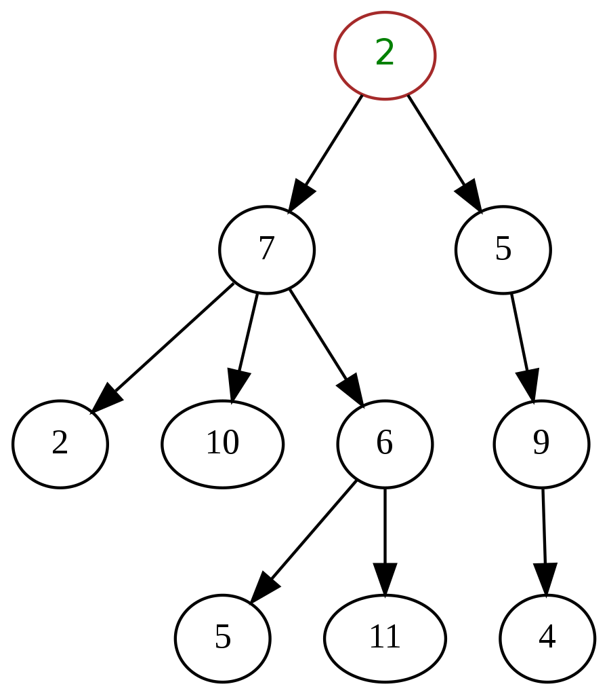
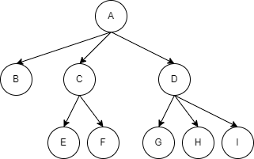
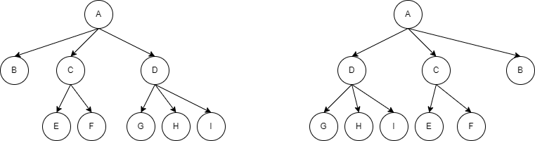
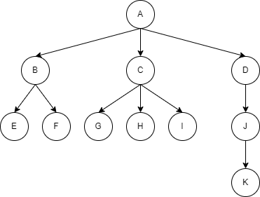
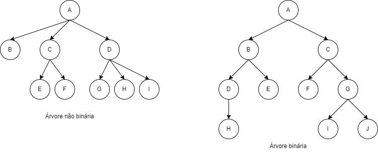
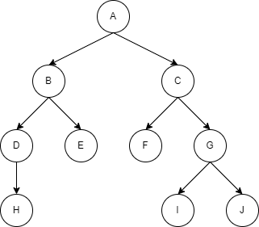

# Aula 08 - Árvores

Uma `árvore` é uma `estrutura de dados` hierárquica que contém um conjunto de nós conectados. Quando desenhada, essa 
estrutura lembra uma árvore, daí o seu nome. Essa estrutura modela a hierarquia entre elementos.



Há uma variedade enorme de suas aplicações:

* Sistemas de arquivos
  * Estrutura de diretórios/pastas.
* DOM (_Document Object Model_) do `HTML` e `XML`.
* Processamento de linguagem natural
  * A forma como as frases são decompostas.
* Compiladores
  * A partir da decomposição de comandos.

## Terminologia e propriedades

* Nó
  * Qualquer vértice de uma árvore.
* Nó raiz
  * É o vértice que está mais acima na hierarquia de uma árvore.
* Nó filho
  * É o vértice sucessor de outro vértice.
* Nó pai
  * É o vértice antecessor de outro vértice.
* Nó folha
  * Um vértice que não possui qualquer sucessor, ou filho. Também conhecido como nó terminal.
* [Nós] irmãos
  * Vértices sucessores de um mesmo vértice antecessor.
* Nó interno
  * Qualquer vértice que possua filho.
* Arco ou aresta
  * A conexão (direcionada ou não) entre dois nós.
* Caminho
  * Lista de vértices distintos e sucessivos, conectados por arcos de uma árvore.
  * Existe exatamanente um caminho entre o nó raiz e cada um dos demais nós da árvore.
    * Se houver mais de um caminho, ou nenhum, então temos na verdade um `grafo`.
* Grau de um vértice
  * É o número de subárvores não vazias de um nó.

  * Exemplo
    * Grau de A = 3
    * Grau de C = 2
* Qualquer nó é a raiz de uma subárvore consistindo dele e dos nós abaixo dele.



* A diferença entre duas árvores se dá pela ordem de suas subárvores.
  * Uma árvore ordenada é definida como uma árvore onde as subárvores formam um conjunto ordenado.
  * Em uma árvore ordenada define-se o primeiro, segundo e último irmão, de acordo com alguma propriedade.



* Os vértices estão classificados em `níveis`
  * O número de nós no caminho entre o vértice e a raiz.
  * Nível da raiz é 0.
  * Nível de um nó: nível do pai + 1.
* Altura de uma árvore
  * Corresponde ao maior nível
* Floresta
  * Conjunto de árvores.
  * Se removemos a raiz e os arcos que a ligam às subárvores, ficamos com uma floresta.

## Árvore Binária

Uma `árvore binária` é aquela cujo cada nó tem, **no máximo**, dois filhos.



Em uma `árvore binária` os nós filhos são ordenados como `filho da direita` e `filho da esquerda`.

Operações comuns em uma `árvore binária`:

* Visualizar(p): visualiza o conteúdo do nó apontado por _p_.
* Esquerda(p): leva o programa ao filho da esquerda de _p_.
* Direita(p): leva o programa ao filho da direita de _p_.
* Pai(p): leva o programa ao pai de _p_.
* Irmão(p): leva o programa ao irmão de _p_.
* isLeft(p): retorna `true` se _p_ é filho da esquerda.
* isRight(p): returna `true` se _p_ é filho da direita.
* Criar: cria uma `árvore binária` vazia ou contendo apenas o nó raiz.
* Criar Filho Esquerda(p,x): cria uma filho da esquerda para o nó _p_ e conteúdo _x_.
* Criar Filho Direita(p,x): cria uma filho da direita para o nó _p_ e conteúdo _x_.
* Remover(p): remove o nó _p_, reorganizando a árvore, se necessário.

### Formas de se percorrer uma árvore binária



* Pré-ordem ou prefixo
  * Raiz -> Esquerda -> Direita
  * A -> B -> D -> H -> E -> C -> F -> G -> I -> J
* Em ordem ou infixo
  * Esquerda -> Raiz -> Direita
  * H -> D -> B -> E -> A -> F -> C -> I -> G -> J
* Pós-ordem ou posfixo
  * Esquerda -> Direita -> Raiz
  * H -> D -> E -> B -> F -> I -> J -> G -> C -> A

Para se percorrer, o método `visualizar(p)` pode ser usado de forma `recursiva`, ou seja, quando um método chama a 
ele mesmo. Ex.:

```c
void preOrdem(No *no){
    printf("%d ", no->valor);
    preOrdem(no->esquerda);
    preOrdem(no->direita);
}

void emOrdem(No *no){
    emOrdem(no->esquerda);
    printf("%d ", no->valor);
    emOrdem(no->direita);
}

void posOrdem(No *no){
    posOrdem(no->esquerda);
    posOrdem(no->direita);
    printf("%d ", no->valor);
}
```

## Exercício

Desafio:

1. Criar um sistema para manipular uma estrutura de dados do tipo árvore.
2. A estrutura deve ter os seguintes atributos: int num; int nivel; estrutura *direita; estrutura *esquerda;
   1. O primeiro atributo *num*, pode ter outro nome, contanto que seja a variável para receber o valor inteiro do nó.
   2. O segundo atributo *nivel*, deve conter o nível daquele nó. Ou seja, a raiz da árvore vai ter nível = 0. Seus dois filhos vão ter nível 1, e assim sucessivamente.
   3. Os outros dois atributos servem de ponteiro para os filhos da direita e da esquerda.
   4. Perceba que neste desafio não haverá ponteiro para o pai, pois deve ser utilizada recursão.
3. As funções que devem estar presente no trabalho: **criar**, **vazia**, **inserir**, **buscar**, **imprimir**, **esvaziar**, **altura**.
   1. A função **criar** deve verificar se a árvore já foi criada. Caso positivo, retornar uma mensagem avisando. Caso negativo, atribuir NULL ao ponteiro da raiz.
   2. A função **vazia** deve verificar se a árvore está vazia, ou seja, se o ponteiro para a raiz tem o valor NULL.
   3. A função **inserir** deve verificar primeiro se a árvore já tem raiz. Caso seja a inserção da raiz, criar o nó com alocação dinâmica (malloc) e pedir ao usuário inserir o valor da variável **num**. Caso já exista o nó raiz, a função deve garantir que os números menores devem ser guardados na sub árvore da esquerda, enquanto os números maiores devem estar na sub árvore da direita (neste ponto vale a recursão). Exemplo: se o nó raiz estiver com o número 20, e o usuário tentar inserir o número 13, a função deve guardar esse novo número na sub árvore da esquerda.
   4. A função **buscar** deve fornecer ao usuário as seguintes opções: buscar um nó; buscar o pai de um nó; buscar o filho de um nó; buscar todos os nós de um determinado nível. A primeira opção deve retornar apenas o nível do nó buscado. A segunda opção deve retornar o valor e nível do pai do nó passado. A terceira opção deve retornar o valor e nível do(s) filho(s) do nó passado. A última opção deve imprimir os valores de todos os nós de um determinado nível, escolhido pelo usuário.
   5. A função **imprimir** deve fornecer ao usuário as seguintes opções: imprimir em pré ordem, em ordem e pós ordem. A impressão deve seguir a escolha do usuário.
   6. A função **esvaziar** deve fornecer ao usuário as seguintes opções: apagar um nó; apagar toda a árvore. Na primeira opção, o nó escolhido e toda a sua sub árvore são apagados. A última opção deve apagar todos os registros da árvore, inclusive o nó raiz. Lembrando que para apagar, os onteiros tem de ser todos modificados para NULL e, antes disso, as memórias devem ser liberadas (free).
   7. A função **altura** deve retornar a altura corrente da árvore.